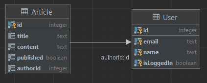

# М33081 Аль Даббагх Харит

## Web-Programming Project - Semester 6

### User - Модель для сущности пользователя, которая имеет имя, электронную почту и статус авторизации.

### Article - Модель для сущности article, которая имеет название, содержание, ID автора и состояние опубликованности.